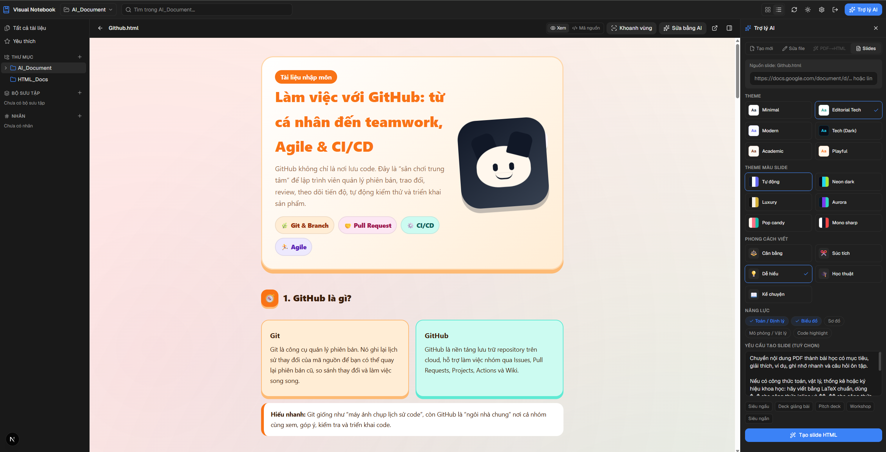

# Visual Notebook



Demo HTML files: `/demos/`, `/demos/fastapi-production.html`,
`/demos/calculus-derivative.html`, `/demos/git-workflow.html`.

Trạm quản lý file **HTML/Markdown/PDF** học tập với **trợ lý AI** — tổ chức trực quan kiểu Notion,
đọc/ghi trực tiếp file trên ổ đĩa của bạn ngay trong trình duyệt (không upload lên cloud).

## Tính năng

- 📂 **Đồng bộ ổ đĩa thật** qua File System Access API — chọn 1 thư mục (vd `d:\AIO2026`),
  app đọc/ghi trực tiếp các file `.html`/`.md`/`.pdf`. Dữ liệu không rời máy bạn.
- 🗂️ **Quản lý trực quan**: cây thư mục, bộ sưu tập (thư mục ảo), nhãn (tag), yêu thích,
  tìm kiếm. Metadata lưu trong `.visualnotebook/manifest.json` ngay trong thư mục.
- 👁️ **Xem & sửa**: preview HTML/Markdown trong iframe, trình xem PDF, trình soạn mã nguồn (CodeMirror).
- 🤖 **Trợ lý AI** (đa nhà cung cấp: Claude / OpenAI / Gemini):
  - Tạo file HTML mới từ mô tả.
  - Sửa file HTML đang mở.
  - Chuyển **PDF → HTML** sạch/đẹp (trích nội dung + ảnh trang rồi AI dựng lại).
- 🎨 **Bộ theme** chọn khi tạo: Minimal, Modern, Tech (dark), Academic, Playful — kèm
  **năng lực**: Toán/định lý (KaTeX), Biểu đồ (Chart.js), Sơ đồ (Mermaid),
  Mô phỏng vật lý (p5.js/Matter.js), Code highlight.

> ⚠️ Cần **Google Chrome** hoặc **Microsoft Edge** (File System Access API). Firefox/Safari chưa hỗ trợ.

## Chạy local

```bash
npm install
npm run dev
```

Mở http://localhost:3333 bằng Chrome/Edge.
Vào ⚙️ Cài đặt → nhập API key của ít nhất một nhà cung cấp để dùng trợ lý AI.

## Deploy lên Vercel

1. Push code lên GitHub và import vào Vercel (hoặc chạy `vercel`).
2. Đặt **Environment Variables** nếu muốn dùng API key chung phía server:
   - (tuỳ chọn) `ANTHROPIC_API_KEY` / `OPENAI_API_KEY` / `GOOGLE_GENERATIVE_AI_API_KEY`
     nếu muốn dùng key dùng chung phía máy chủ thay vì nhập trong app.
3. Deploy. Mở domain Vercel bằng Chrome/Edge.

## Kiến trúc

- **Next.js 16 (App Router)** + React 19 + Tailwind v4, host trên Vercel.
- **Local-first, không cần database**: file trên ổ đĩa + metadata sidecar JSON.
- **AI** qua Vercel AI SDK; các route serverless (`/api/ai/*`) proxy tới nhà cung cấp,
  streaming kết quả để tránh timeout.
